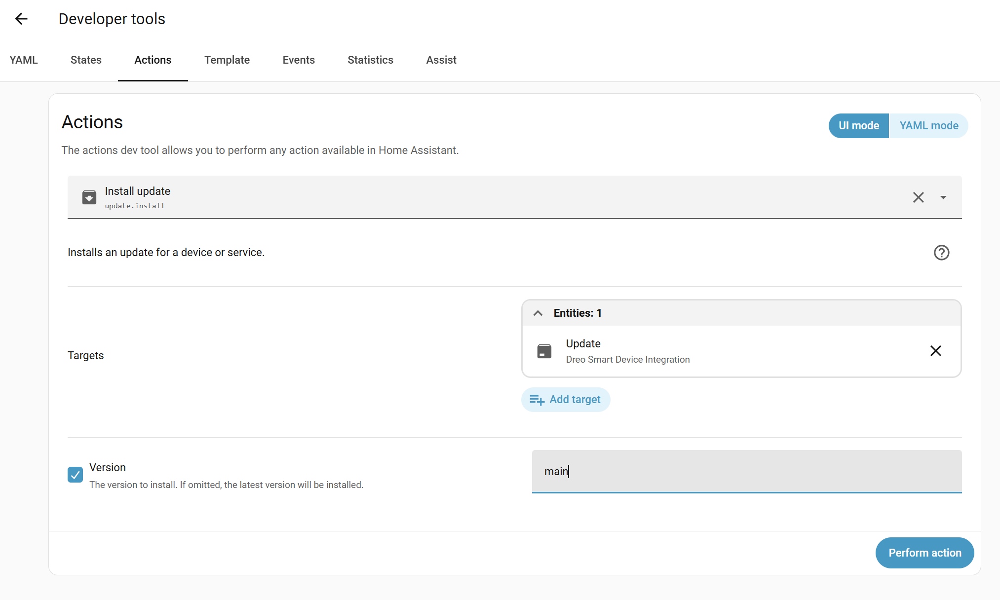

# Testing Unreleased Fixes

This guide explains how to install and test unreleased fixes from the `main` branch before they are officially released.

> **Note:** This guide assumes you have the Dreo Smart Device Integration installed via [HACS](https://hacs.xyz/). If you installed manually, you'll need to update the files manually. The steps below use the [HACS Update entity](https://hacs.xyz/docs/use/entities/update) to install a specific version.

## Why Test Pre-Release Code?

When a bug fix or new feature is developed, it goes through these stages:
1. **Pull Request (PR)** - Code is submitted for review
2. **Merged to main** - Code passes review and is merged
3. **Release** - A new version is published to HACS

Testing pre-release code helps:
- Verify fixes work on your specific device
- Catch issues before they affect all users
- Speed up the release process

## Prerequisites

- Home Assistant with HACS installed
- Dreo Smart Device Integration already installed via HACS

## Installing from Main Branch

Use this when a maintainer asks you to test code from `main` that hasn't been released yet.

### Steps

1. Go to **Developer Tools → Actions**

2. Search for and select **Install update** (`update.install`)

3. Under **Targets**, click **Add target** and select **Update: Dreo Smart Device Integration**

4. Check the **Version** checkbox and enter the version you want to install:

   | Value | Example | Description |
   |-------|---------|-------------|
   | Branch name | `main` | Install from a branch (must match exactly) |
   | PR branch | `refs/pull/123/head` | Install directly from a pull request (replace `123` with the PR number) |
   | Release tag | `v1.9.20` | Install a specific release version |

5. Click **Perform action**



6. **Restart Home Assistant**
   - Go to **Settings → System → Restart**

7. **Test and report back**
   - Test the specific functionality that was fixed
   - Report results on the GitHub issue or PR

## Reverting to Stable Release

To go back to the latest stable release, follow the same steps but leave the **Version** field empty (unchecked). This will install the latest released version.

## Providing Feedback

When reporting test results:

1. **Include your version info**
   - Home Assistant version
   - The branch you tested (e.g., `main`)
   - Your device model

2. **Describe what you tested**
   - Specific features or bug fixes
   - Steps you took

3. **Share results**
   - Did it work? Partially? Not at all?
   - Include relevant logs if there are issues

4. **Enable debug logging** if needed:
   ```yaml
   # In configuration.yaml
   logger:
     default: info
     logs:
       custom_components.dreo: debug
   ```

## Troubleshooting

### Integration doesn't load after update
- Check Home Assistant logs for errors
- Try restarting Home Assistant again

### Device not responding after update
- Reload the integration: **Settings → Devices & Services → Dreo → ⋮ → Reload**
- Check if your device credentials are still valid

## Questions?

If you have issues with testing pre-release code, comment on the relevant GitHub issue or open a new one with the `question` label.
